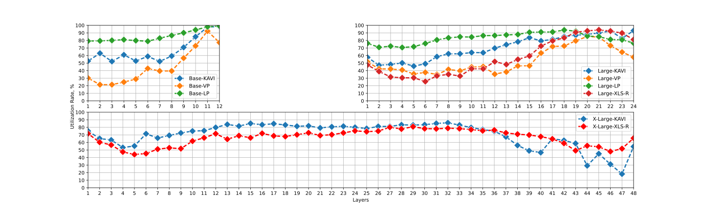

# Large-scale monolingual speech foundation models
Scripts for training large-scale monolingual speech foundation models with 158K hours of Finnish speech

## Pre-trained and fine-tuned (4,600 hours) models

Model
|---
[wav2vec 2.0 Base Pre-trained](https://zenodo.org/doi/10.5281/zenodo.13754087) 
[wav2vec 2.0 Base Fine-tuned](https://zenodo.org/doi/10.5281/zenodo.13754085) 
[wav2vec 2.0 Large Pre-trained](https://zenodo.org/doi/10.5281/zenodo.13754083) 
[wav2vec 2.0 Large Fine-tuned](https://zenodo.org/doi/10.5281/zenodo.13754081) 
[wav2vec 2.0 X-Large Pre-trained](https://zenodo.org/doi/10.5281/zenodo.13754079)
[wav2vec 2.0 X-Large Fine-tuned](https://zenodo.org/doi/10.5281/zenodo.13754077)

More details on the models are available in the [paper](TODO).
The models are also available at [Huggingface Hub](https://huggingface.co/collections/GetmanY1/wav2vec2-fi-150k-66c9d75d18579088974ea37f)

## Training logs

Developing a foundation model from scratch requires not only vast amounts of unlabeled speech data but also substantial computational resources. Moreover, extensive hyperparameter search is often not feasible for large-scale models. Therefore, we are glad to share our pre-training logs on Weights & Biases (W&B) to provide more insights for other researchers developing their own speech foundation models.

* [wav2vec 2.0 Base](https://wandb.ai/getmanya/wav2vec2_base_KAVI?nw=nwusergetmanya)
* [wav2vec 2.0 Large](https://wandb.ai/getmanya/wav2vec2_large_KAVI?nw=nwusergetmanya)
* [wav2vec 2.0 X-Large](https://wandb.ai/getmanya/wav2vec2_1B_KAVI?nw=nwusergetmanya)

## Data pre-processing

The raw, unlabeled TV and radio data are organized into 1-hour files, each located in the directory `channel_name/year/month/day/channel_name_start_time-end_time.ts`:

```
.
└── raw_tv_and_radio_data/
    ├── radio_channel_1/
    │   ├── 2009/
    │   │   ├── 01/
    │   │   │   ├── 01/
    │   │   │   │   ├── radio_channel_1_0000-0100.ts
    │   │   │   │   ├── radio_channel_1_0100-0200.ts
    │   │   │   │   └── ...
    │   │   │   ├── 02/
    │   │   │   │   └── ...
    │   │   │   └── ...
    │   │   ├── 02/
    │   │   │   └── .../
    │   │   │       └── ...
    │   │   └── ...
    │   └── 2010/
    │       └── .../
    │           └── .../
    │               └── ...
    ├── tv_channel_2/
    │   └── ...
    └── ...
```

1. Convert the files to 16kHz mono flac audio by running `scripts/data_preprocessing/convert_to_flac.sh`. The script preserves the original folder structure.
2. Run voice activity detection (VAD) to split the data into shorter utterances and reduce the non-speech events, such as music, noise, and silence, and put them into _uncompressed_ (.tar) tarballs.
**Note:** Fairseq does not support compressed archives
**Note:** Millions of small files affect the performance of any filesystem. As a result, quotas on Lustre filesystems are typically limited to several million files. To avoid running out of quota, put the short audio files into a .tar archive after VAD-based segmentation of a small part of the raw data (one day, month, or year), and remove them immediately afterward. You can also consider storing the preprocessed audio files in the `/tmp` folder, which usually does not consume the quota.

## Pre-training the models

The scripts shared in this repository are adapted to the AMD hardware of the [LUMI supercomputer](https://www.lumi-supercomputer.eu/). To train a wav2vec 2.0 Base model, run

```
sbatch /scripts/pretraining/pretrain_wav2vec2_base.sh
```

Note: you can simulate 512 GPUs by using k GPUs and adding command line parameters (before `--config-dir`)
`distributed_training.distributed_world_size=k` `+optimization.update_freq='[x]'` where x = 512/k

## Fine-tuning the models with CTC

To fine-tune a wav2vec 2.0 Base model using Fairseq, run

```
sbatch scripts/finetuning/full-scale-asr/finetune_wav2vec2_base.sh
```

* When pre-training on the LUMI supercomputer using Fairseq, it is crucial to set `export MIOPEN_FIND_MODE=2`. MIOpen is AMD’s deep-learning primitives library for GPUs (counterpart of NVIDIA's cuDNN). Setting the Find Mode to `2`, or `FAST` is crucial for optimal pre-training speed, otherwise pre-training is 10-20x times slower. More details on MIOpen Find modes are available [here](https://rocm.docs.amd.com/projects/MIOpen/en/docs-5.6.0/find_and_immediate.html) 

* You can simulate 128 GPUs by using k GPUs and adding command line parameters (before `--config-dir`)
`distributed_training.distributed_world_size=k` `+optimization.update_freq='[x]'` where x = 128/k

* For more LUMI-specific details on training with AMD GPUs, see [here](https://lumi-supercomputer.github.io/LUMI-training-materials/4day-20231003/extra_4_10_Best_Practices_GPU_Optimization/), [here](https://lumi-supercomputer.github.io/LUMI-EasyBuild-docs/p/PyTorch/), and [here](https://462000265.lumidata.eu/ai-20240529/files/LUMI-ai-20240529-10-Extreme_scale_AI.pdf).

## Fine-tuning the models with CTC using 🤗Transformers

To fine-tune a wav2vec 2.0 Base model using Huggingface Transformers, run

```
sbatch scripts/finetuning/low-resource-asr/finetune_wav2vec2_base.sh
```

## Computing Layer Utilization Rate (LUR)



To calculate the neuron attributions for all layers using Integrated Gradients (IG), run `scripts/interpretation/ig.sh`. After that, run the notebook `scripts/interpretation/compute_LUR.ipynb` to visualize the Layer Utilization Rates (LURs).

More details on the LUR are available in the [paper](TODO).
